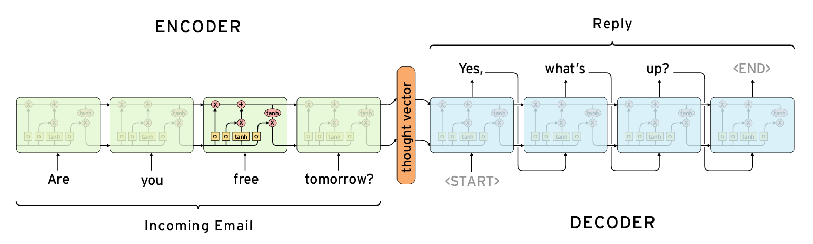

# Introduction

The transformer model was first introduced in a 2017 paper titled "Attention Is All You Need"
(https://arxiv.org/abs/1706.03762) published by Google. Little did the researchers know at the time, this paper would
soon become one of the most cited papers of the 21st century and would provide the
basis behind all major AI models today.

Prior to the development of the transformer model, there has been many architectural
models built in hopes of best achieving true artificial intelligence. In this blog,
I am not aiming to give full technical and mathematical understanding of the underlying
components of the transformer model, rather my goal is to give you an overview of what
truly makes the transformer architecture amazing, while providing additional resources
for anyone interested in learning further.

Although not necessary but it can be useful to be briefly aware of the following
terminology:

- **Large Language Models (LLMs) :** think of these as the "brain" behind the AI, it is
  where all the learning and computations is done before producing a result.

- **Tokens :** are the standard unit for LLMs, but for the sake of simplicity, I will
  simply refer to them as one token = one "word", while in reality 1 token is roughly
  3/4th of a word.

- **Parameters / Weights :** is the numbers that the LLM tries to optimize through a
  process called "pre-training".

- **Activation Function :**
- **LLM Vocabulary:** this is a predefined "vocabulary" of words that contains all
  the words the LLM will be trained on. For example: GPT3 contains a 100,261 token
  vocabulary.

It can be overwhelming seeing the transformer structure for the first time, rest assured
we will not be diving deep into every component, however it is still useful to have an
idea of what it looks like.

The transformer model consists of the following main components:

- Encoder
- Feed Forward Neural Networks
- Multi-Head Attention
- Layer Normalization
- Decoder

Before we start explaining what each component does, there are a few important points
to keep track of:

- Instead of thinking of the transformer as some form of magic that gives
  artificial intelligence it's "thinking" capacity, it would be a lot easier to move
  forward thinking of it as a "next-word" predictor. This will start to make sense the deeper
  we dive into the details.

- There will be some additional details added at the bottom of the page, which applies
  as a summary, feel free to read through it.

  

## Encoder

The encoder is responsible for creating meaningful numeric representation of input.
The details of how this is done is not important for now, just know that through
some mathematical transformations, all words can be represented with a single long vector.

## Feed Forward Neural Network

This is the simplest form of Neural Networks. Think of a neural network similarly
to how you'd think of the neurons in our brains and how interconnected they are
together. The neural network can be broken down into 3 layers, each neuron is connected
to every neuron at the forwarding layer:

1. **Input layer:** typically text, simply recieves the raw data, each node representing
   one feature of your input.

2. **Hidden layers:** these are where all the learning happens, each node applies some
   weight from the previous layer as well as a activation function, then eventually
   passing the result into the forwarding layer.

3. **Output layer:** produces the final output — a probability score for every word
   in the predefined vocabulary.

Each layer of the neural network "fires" to the proceeding layers and so on, until the last layer comes out with an output. The word with the highest score will be picked, however this will lead to deterministic results to the same input everytime. As a result, different techniques have been developed
to avoid picking the same word everytime to provide a different response everytime. Such
as randomly picking among the top k highest probability scores.

## Normalization Layers

Think of these layers, almost as a form of reset on the numbers being passed from each layer to the next.
Why would we need to reset the values? well, sometimes the values can get too large
or too small, skewing the learning process of our neural network. The normalization
does not entirely reset the value, but rather it performs a mathematical function that
keeps the value within a certain range no matter how large or small it originally was.
This helps us avoid the problem of overly large/small numbers.

 

## Multi-Head Attention Block

Is the core revolutionary component of the transformer model, the attention block
itself deserves it's own article, however we will explain the gist of what the
attention mechnism is and what it does.

_"Determines how relevant a word is in a sentence, relative to the other words in that sentence."_

If you understand that sentence, the implications of what makes this mechanism game
changing becomes obvious. To be able to grade the relevance of a certain word
relative to all the other words in a given sentence or paragraph makes the Aritifical
Intelligence much more capable of understanding what the "weight" of those words mean.

Again, this happens due to a series of mathematical calculations, while that is
out of the scope of this article, many are familiar with the dot-product as a
method of determining the distance between two vectors. Recall the encoder mentioned
earlier? since words (or tokens) can be represented using vectors, performing dot-product
calculations between the vector representations of each word in a sentence
relative to the other words in that sentence, will actually give us a form of
"similarity test", originally, the test will be a raw score which is then passed to a function
(softmax) and will produce **attention weights**, a vector of percentages representing
how much should each word "attend" to every other word.

 

## Decoder

Somewhat similar to the encoder, the decoder uses the encoder's vector representations
then **autoregressively** generates one word (token) at a time.

 

 

The image shows an example of the encoder taking in some user input "_Are you free tomorrow?_",
and purely through the mechanism of the transformer block and neural network. The LLM
is capable of identifying what is the most appropriate response, almost seemingly
like it understands the question.

 

## Summary

To sum it up, we realise that "_artificial intelligence_" is nothing more than an
incredibly complex next word generator. It takes your input, analyzes it, based on
some statistics, it returns whatever word it thinks comes next.

Regardless, it is still fascinating to think that such a seemingly simple concept
can produce unbelieveable results.

This should also reassure you that these models do not possess anything close to a
genuine form of "_intelligence_". Even though AI can not truly understand human Language,
it is remarkable the results and applications that were made capable by it.

Yes, even your favourite image generation AIs use the transformer model at its core,
they just apply different strategies to make it work.

 

## References

- "Attention Is All You Need" paper: https://arxiv.org/abs/1706.03762
- "Attention in transformers, step-by-step" by 3blue1brown: https://www.3blue1brown.com/lessons/attention
- The Illustrated Transformer by Jay Alammar: https://jalammar.github.io/illustrated-transformer/
